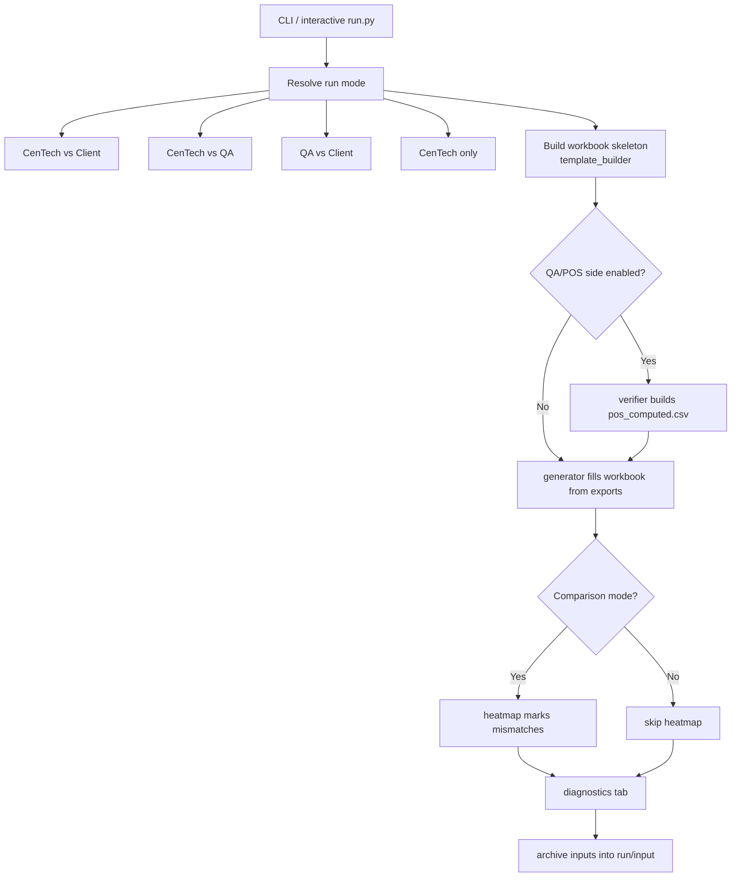
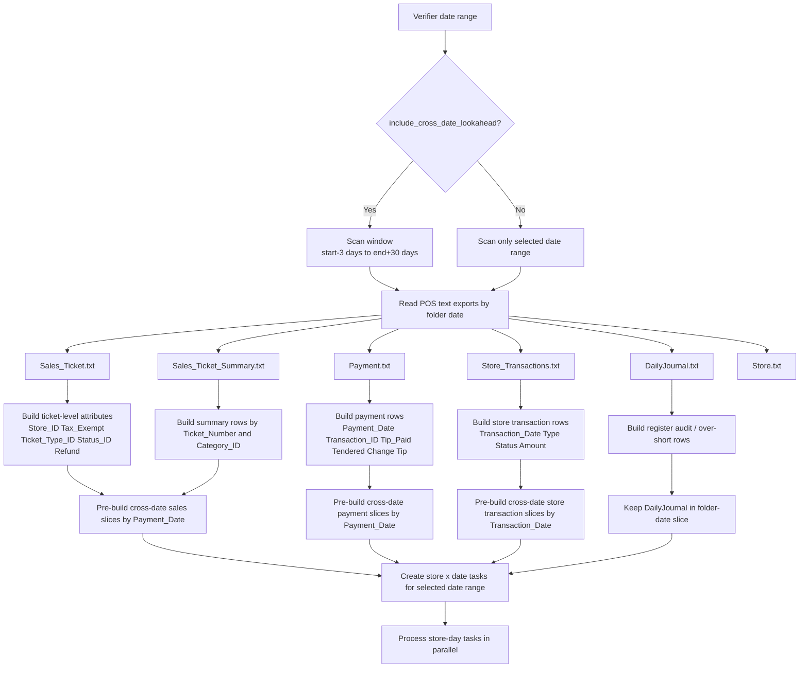
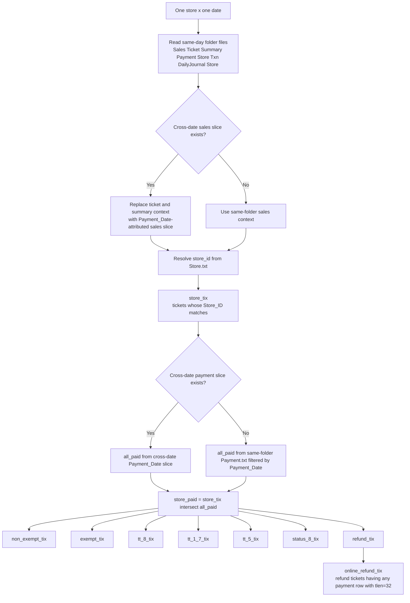
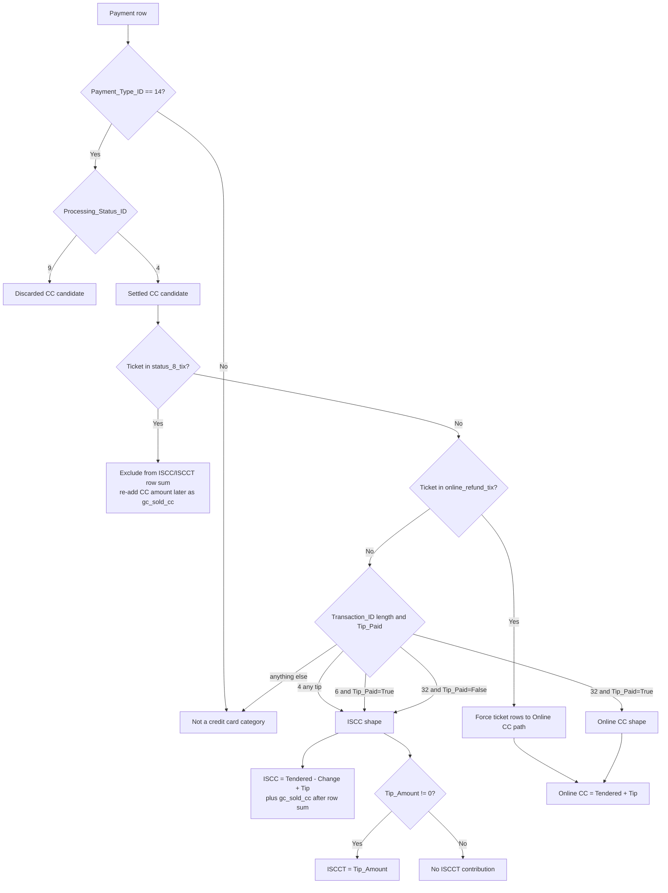
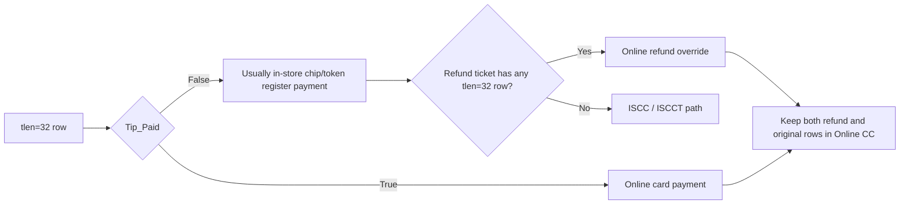
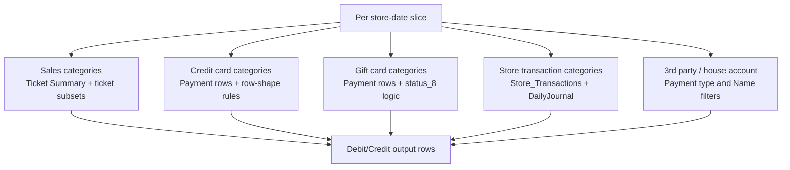
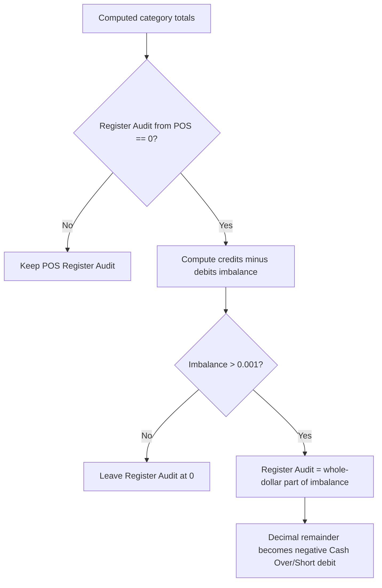

# Sales Export Calculation Data Flow

This diagram explains how the current implementation reads data, computes QA/POS category
rows, and feeds the workbook comparison pipeline.

It is based on the current code path in:

- `financial/sales_export_comparison/run.py`
- `financial/sales_export_comparison/stages/verifier.py`
- `financial/sales_export_comparison/stages/generator.py`

## 1. End-to-end pipeline flow

## 2. Verifier scan and attribution flow

## 3. Store-day calculation context

## 4. Card payment decision flow

## 5. Why `tlen=32` splits two ways

Interpretation:

- `tlen=32` alone does not mean online.
- `tlen=32` with `Tip_Paid=False` is the in-store chip/token shape used by the POS.
- `tlen=32` with `Tip_Paid=True` is online card activity.
- Online refunds are forced into `Online CC` as a ticket-level override so the reversal nets
  in the same bucket as the original online charge.

## 6. Category family calculation map

## 7. Register audit balancing branch

This branch exists in `verifier.py` and is implementation-specific. It is not just a
presentation rule; it changes the emitted QA/POS output rows when no POS Register Audit row
exists and credits exceed debits.

## 8. Read order in practice

1. Read all relevant folders in the expanded scan window.
2. Optionally expand that scan window by 3 days before start and 30 days after end.
3. Pre-build cross-date payment slices keyed by `Payment_Date`.
4. Pre-build cross-date store transaction slices keyed by `Transaction_Date`.
5. Pre-build cross-date ticket/summary slices keyed by `Payment_Date`.
6. For each selected store-date, compute one store-day task in parallel.
7. Emit non-zero QA/POS category rows into `pos_computed.csv`.
8. Feed that CSV into the workbook generator when the run mode uses QA.
9. Apply heatmap and diagnostics in workbook-comparison modes.
